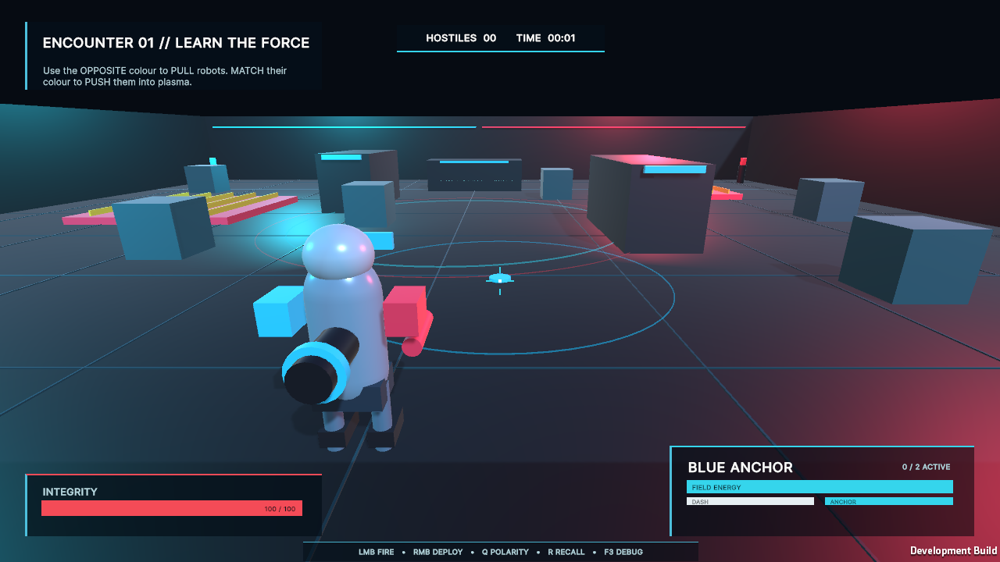

# Polarity Protocol

A portfolio-focused third-person combat demo built in Unity and C#. Players deploy red and blue magnetic anchors to pull or repel robots, physics props, shield plates, and hostile projectiles through a neon containment arena.

**[Play in browser on itch.io](https://marvelousjade.itch.io/polarity-protocol)** · **[Architecture](docs/ARCHITECTURE.md)** · **[Performance](docs/PERFORMANCE.md)**

- **Focus:** gameplay systems, physics, enemy AI, tools, UI, testing, and performance
- **Engine:** Unity `6000.4.11f1` · C#
- **Scope:** all gameplay code, procedural art, UI, audio, and tooling are first-party; no marketplace assets or gameplay packages

## Gameplay

- Place up to two persistent magnetic anchors on arena surfaces.
- Use opposite polarities to **pull** and matching polarities to **push**.
- Redirect polarity-coded enemy projectiles back toward their shooter.
- Pull off an opposite-colour shield plate, then switch polarity to move the exposed robot.
- Push enemies into plasma hazards across three escalating encounters.
- Finish quickly and efficiently to improve the final score.

## Engineering highlights

- Pure, unit-tested magnetic force solver with stable distance falloff
- Non-allocating field queries with compound-collider deduplication
- Three enemy archetypes with hazard steering and polarity-based counterplay
- Pooled, faction-aware projectiles with ownership transfer and return steering
- ScriptableObject-driven abilities, enemies, and encounters
- Runtime composition root with explicit dependency wiring and narrow static seams
- Responsive UI Toolkit HUD and menus with keyboard/controller navigation
- Encounter-authoring window, F3 diagnostics, stress scene, and packaged benchmark mode
- Procedural arena, materials, animation, and synthesized feedback audio

The runtime follows **data → simulation → orchestration → presentation**. Magnetics report through `MagneticTarget`, combat uses a shared `DamageInfo` pipeline, and pooled projectiles are created only through `ProjectilePool`. See [Architecture](docs/ARCHITECTURE.md) for the full system boundaries.

## Controls

| Action | Keyboard and mouse | Controller |
|---|---|---|
| Move / look | `WASD` / mouse | Left / right stick |
| Fire | Left mouse | `RB` or `A` |
| Place anchor | Right mouse | `LB` |
| Change polarity | `Q` | `X` |
| Recall anchors | `R` | `Y` |
| Dash / sprint | `Space` / `Shift` | `B` / left-stick press |
| Pause | `Esc` | Menu |
| Diagnostics | `F3` | Keyboard only |

## Run and build

1. Open the repository in Unity `6000.4.11f1`.
2. Open `Assets/PolarityProtocol/Scenes/PolarityProtocolDemo.unity`.
3. Press Play.

The checked-in scene is intentionally minimal; `ArenaBootstrap` constructs and wires the demo at runtime. Persistent tuning is stored in generated ScriptableObject assets.

Use **Tools → Polarity Protocol** to:

- **Build Demo Project** — regenerate data and scenes
- **Build Windows Player** — create `Builds/Windows/PolarityProtocol.exe`
- **Build WebGL Player** — create the browser player and itch.io-ready `Builds/PolarityProtocol-WebGL.zip`
- **Encounter Authoring** — edit and validate encounter layouts

## Validation

- **13/13 Edit Mode tests passed**
- **10/10 Play Mode tests passed**
- Windows x64 and WebGL builds verified
- Packaged-player smoke run completed without runtime exceptions

The reproducible stress workload adds 18 robots and 120 projectiles. On a Ryzen 5 3600, Radeon RX 5700, and 16 GB RAM at 1280×720, the UI Toolkit feature run averaged **106.7 FPS / 9.38 ms**, with **2 Gen-0 collections**. See [Performance](docs/PERFORMANCE.md) for methodology and caveats.

## License and notices

Unity primitive meshes, built-in shaders, default font resources, engine binaries, and the Unity Test Framework remain subject to Unity's terms. See [Third-party notices](THIRD_PARTY_NOTICES.md).
